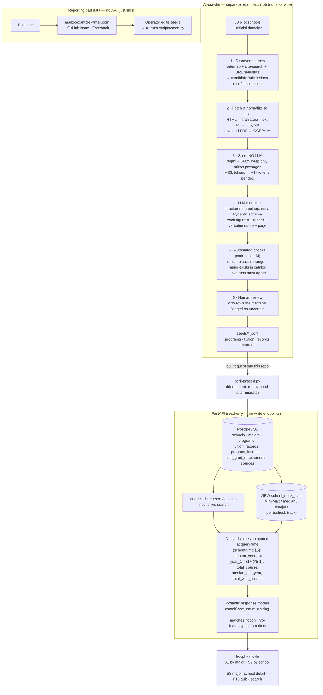
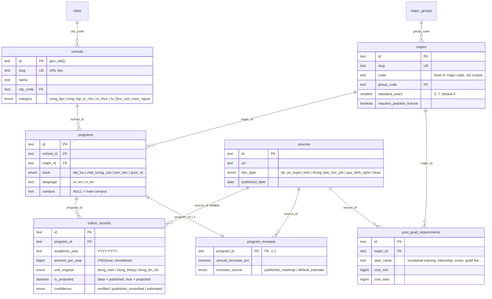

<p align="right">
  <a href="README-en.md"> English</a>
  &nbsp;|&nbsp;
  <a href="README.md"> Tiếng Việt</a>
</p>

# hocphi-info-be

**Backend for [hocphi.info](../hocphi-info) — tuition data for 100+ universities and colleges in Vietnam.**

It normalizes each major–school tuition figure to `VND/year`, splits it by program track, and
estimates the **full-course cost** (4–6 years) from the annual tuition-increase rate.

- [hocphi-info-be](#hocphi-info-be)
  - [I. How it works](#i-how-it-works)
  - [II. Why it's designed this way](#ii-why-its-designed-this-way)
  - [III. Tech stack](#iii-tech-stack)
  - [IV. Project layout](#iv-project-layout)
  - [V. Data model](#v-data-model)
  - [VI. Getting started](#vi-getting-started)
  - [VII. Roadmap](#vii-roadmap)

## I. How it works

This backend is **read-only**. Data comes in through exactly one path: the **AI-crawler**
(separate repo) produces seed files, an operator reviews them, and `scripts/seed.py` loads
them into the DB.



The DB stores the source numbers (one tuition figure per program per academic year); **every
derived number** — full-course total, median per year, Min–Max range — is computed at query
time, never stored, to avoid figures drifting out of sync. Every number traces back to a
dated row in `sources`, with the verbatim quote and page number from the original document.

## II. Why it's designed this way

**1. Normalize units at ingestion time.** Each school publishes tuition differently
(VND/month, VND/credit, VND/year) inside a PDF admissions plan — Vietnam has no mandatory
standardized source like [IPEDS](https://nces.ed.gov/ipeds/) (US) or
[Discover Uni](https://discoveruni.gov.uk/) (UK). That is precisely why this project has to
crawl: there is no API to call. The backend converts everything to `amount_per_year` and
keeps `amount_original` + `unit_original` for reconciliation when figures are disputed.

**2. "Program track" is its own entity (`programs`), not a column.** Tuition for
high-quality / advanced / international tracks is 3–5× the standard track. Mixing them when
computing a median skews the number. `programs` = `school × major × track × language × campus` —
the smallest unit with exactly one tuition figure.

**3. Store only source numbers; compute derived numbers in the API layer.** Full-course total,
median per year, Min–Max range… are all functions of the source numbers + increase rate.
Storing them creates opportunities for data to drift. The `school_track_stats` VIEW and the
formulas in `schema.md` §5 do this at query time.

**4. Published vs projected is distinguished at the data layer.** An `is_projected` column on
each `tuition_records` row — "Year 1" is the school's published figure, "Years 2..N" are
projections from the increase rate. The UI always labels this and never guesses.

**5. Ingestion via AI-crawler + human review, no admin CRUD / auth.** The hardest part of
the project is collecting data, not writing code — so that is what gets automated, while the
API keeps its simplest possible shape: **no write endpoints at all**. The crawler lives in a
separate repo (heavy deps: headless browser, OCR, models), runs as a batch job, and talks to
this repo through **files** (`seeds/*.jsonl`) via pull request — not through a shared DB
connection. The operator is the final gate: the machine proposes, a human approves,
`seed.py` loads.

**6. No API for reporting bad data.** The `data_issue_reports` table (F17) was dropped
(2026-09-04). A public write endpoint means spam handling, rate limiting, moderation and
privacy work — in exchange for a few dozen reports a year. At MVP scale, `mailto:` + GitHub
issues + Facebook comments do the same job at zero cost, and the operator has to edit
`seeds/` by hand either way.

**7. ULID `text` primary keys, generated in the DB.** Time-sortable, don't leak row counts
like a serial, and avoid a round-trip to fetch an id before inserting related rows. `slug`
remains the public/URL key for `schools` and `majors`.

## III. Tech stack

FastAPI · PostgreSQL 16 · SQLAlchemy 2.x (async, asyncpg) · Alembic · Pydantic v2 ·
Redis (cache — from Week 5) · pytest · GitHub Actions CI · `uv` · Docker Compose

> **History:** the original roadmap (step B4) planned the backend in **Go**. It switched to
> **Python/FastAPI** (2026-09-04) — this is a FastAPI learning project, just as
> `hocphi-info-fe` is a React learning project. `docs/schema.md` v0.2 is language-independent,
> so the stack change lost no design work. Migrations moved from `golang-migrate` (plain SQL)
> to **Alembic** (`alembic/versions/`).

## IV. Project layout

A **flat, colocated** structure — no repository/service/entity layers. The API is
read / filter / display, not complex business logic; queries sit directly in the feature module.

```
app/
  main.py            # FastAPI(), CORS, exception handler, include routers
  config.py          # pydantic-settings BaseSettings (DATABASE_URL, REDIS_URL, CORS_ORIGINS)
  db.py              # Base, async engine, async_sessionmaker, get_session() dependency
  enums.py           # Python StrEnum ↔ Postgres ENUM (school_category, program_track, …)
  models.py          # ALL SQLAlchemy models in one file (MVP: 11 tables)
  health.py          # GET /health (+ auto-generated /docs Swagger)
  (Week 2+) schools.py, majors.py, search.py, …  # each file = router + Pydantic models
alembic/
  env.py             # async template — points at app.db:Base.metadata
  versions/
    0001_initial_schema.py   # hand-written: gen_ulid(), ENUMs, tables, VIEW, lookup-table seed
scripts/
  seed.py            # loads seeds/*.sql|jsonl via AsyncSession (idempotent)
seeds/
  001_schools.sql    # 50 pilot schools (category/short_name still tentative)
  # (Week 4+) *.jsonl — reviewed output of the AI-crawler repo
tests/
  conftest.py        # fixtures: _schema (alembic upgrade), engine, db (SAVEPOINT rollback)
  test_migrations.py # upgrade head → downgrade base → upgrade head
  test_seed.py       # lookup tables have enough rows; seed loads 50 schools; id = 26-char ULID
  test_models.py     # selectinload works; CHECK violation → IntegrityError
docs/
  schema.md          # design rationale + ERD (v0.2) — the source for app/models.py
  brainstorms/       # (git-ignored) requirements docs
  plans/             # (git-ignored) per-"week" plans
compose.yaml         # postgres + redis + migrate (one-shot) + api
Dockerfile           # multi-stage uv, non-root
.github/workflows/ci.yml
```

The project is split into **"weeks"**, each with a "what we learned this week" section and a
diagram for reading the code — same as `hocphi-info-fe` (owner's background is Flutter/Go,
learning FastAPI by building — see `docs/plans/`).

## V. Data model

Full detail + rationale: [`docs/schema.md`](docs/schema.md). Condensed diagram:



Supporting tables: `app_settings` (key/value — `current_intake_year`, `default_increase_pct`…).
The `school_track_stats` VIEW (Min–Max / median / #majors per
`(school, track)`) powers screen S2. `cities` / `major_groups` / `app_settings` are static
lookup tables keyed by `code` / `key` — no ULID, no soft delete. Business tables all carry
`created_at` / `updated_at` / `deleted_at` (soft delete: queries default to
`WHERE deleted_at IS NULL`).

## VI. Getting started

```bash
cp .env.example .env               # fill in DATABASE_URL, REDIS_URL if not the defaults
uv sync                            # install deps (uv fetches Python 3.12 itself)

docker compose up -d postgres      # Postgres 16 via Docker (:5432)
uv run alembic upgrade head        # build schema + seed lookup tables
uv run python -m scripts.seed      # load 50 pilot schools (idempotent)

uv run uvicorn app.main:app --reload   # API on :8000
curl localhost:8000/health
# Swagger UI: http://localhost:8000/docs
```

Or run everything via Docker Compose (Postgres + Redis + migrate + API):

```bash
docker compose up        # migrate finishes before api starts; API on :8000
```

Checks:

```bash
uv run ruff check . && uv run mypy .
uv run pytest -q
```

Requires PostgreSQL ≥ 14 (uses `pgcrypto`'s `gen_random_bytes` for `gen_ulid()` + generated
columns). `pgcrypto` ships with the `postgres:16-alpine` image.

## VII. Roadmap

7-step product roadmap (see [`../hocphi-info/y-tuong-hoc-phi-dai-hoc.md`](../hocphi-info/y-tuong-hoc-phi-dai-hoc.md) §8):

- [x] **B1** Lock the MVP scope
- [x] **B2** UI mockups (`*.dc.html`)
- [x] **B3** Data schema design — [`docs/schema.md`](docs/schema.md) v0.2
- [ ] **B4** Backend API (**FastAPI** — in progress)
  - [ ] **Week 1** — foundation: schema + Alembic + seed + Docker Compose + `GET /health` + `/docs`
  - [ ] **Week 2** — read endpoints for S1 (by major) / S2 (by school) / F13 (quick search) + Pydantic response models
  - [ ] **Week 3** — major–school detail endpoint (S3) + derived values (`schema.md` §5)
  - [ ] **Week 4** — data contract with the AI-crawler: `seeds/*.jsonl` format,
        `scripts/seed.py` loads JSONL + Pydantic validation + idempotent upsert on
        `(program, academic_year)`
  - [ ] **Week 5** — caching (Redis) + rate limiting + request-id middleware + structured logging
- [ ] **B4b** **AI-crawler** — driven by Claude Code itself (zero API budget), in parallel
      with B4. A `/crawl-truong` skill produces `seeds/*.jsonl` for the 50 pilot schools;
      see [`docs/ai-crawler.md`](docs/ai-crawler.md)
- [ ] **B5** React frontend — [`hocphi-info-fe`](../hocphi-info-fe) (Weeks 1–3 done, running on mock, waiting on this API)
- [ ] **B6** Deploy
- [ ] **B7** User testing
