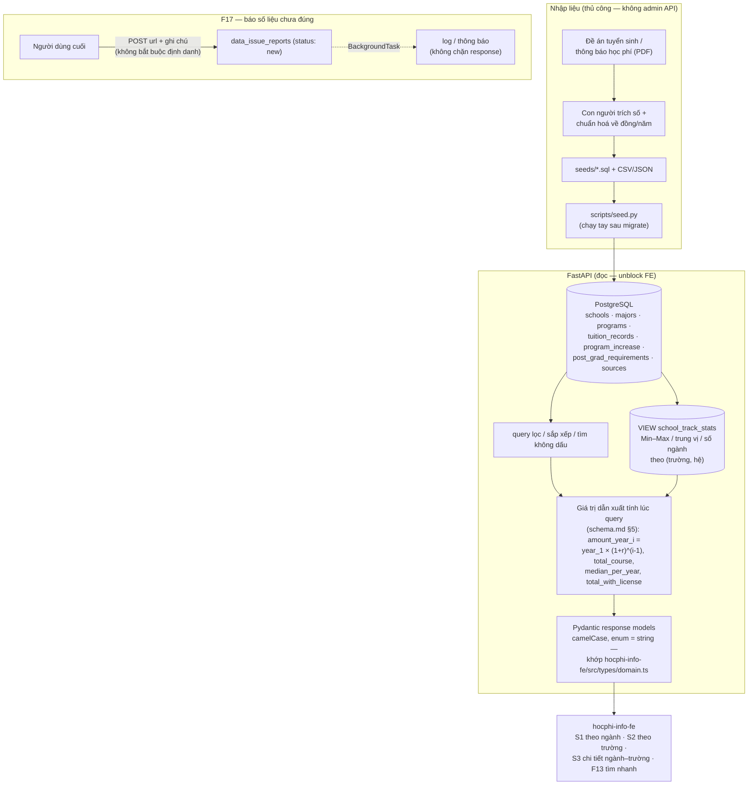
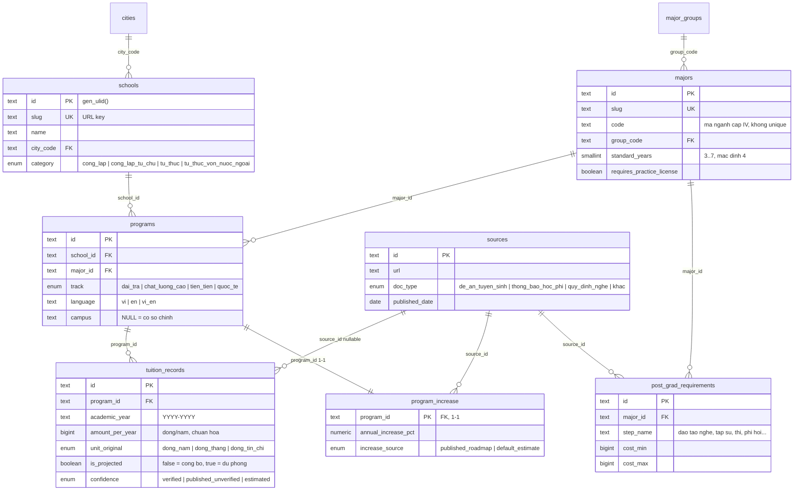

<p align="right">
  <a href="README-en.md"> English</a>
  &nbsp;|&nbsp;
  <a href="README.md"> Tiếng Việt</a>
</p>

# hocphi-info-be

**Backend cho [hocphi.info](../hocphi-info) — thống kê học phí của 100+ trường Đại Học/Cao Đẳng tại Việt Nam.**

Thống kê học phí từng ngành–trường về `đồng/năm`, tách theo hệ đào tạo, và ước lượng
tổng chi phí cả khoá (4–6 năm) dựa trên % tăng học phí hàng năm.

- [hocphi-info-be](#hocphi-info-be)
  - [I. Cách hoạt động](#i-cách-hoạt-động)
  - [II. Vì sao thiết kế thế này](#ii-vì-sao-thiết-kế-thế-này)
  - [III. Công nghệ](#iii-công-nghệ)
  - [IV. Cấu trúc dự án](#iv-cấu-trúc-dự-án)
  - [V. Mô hình dữ liệu](#v-mô-hình-dữ-liệu)
  - [VI. Chạy thử](#vi-chạy-thử)
  - [VII. Lộ trình](#vii-lộ-trình)

## I. Cách hoạt động



Số gốc lưu trong DB (một mức học phí / chương trình / năm học); **mọi con số dẫn xuất**
— tổng cả khoá, trung vị/năm, khoảng Min–Max — tính lúc query, không lưu, để tránh dữ
liệu lệch nhau. Mọi con số truy được về một `sources` có ngày.

## II. Vì sao thiết kế thế này

**1. Chuẩn hoá đơn vị ngay lúc nhập.** Mỗi trường công bố học phí một kiểu (đồng/tháng,
đồng/tín chỉ, đồng/năm) trong PDF đề án tuyển sinh — không có nguồn chuẩn hoá bắt buộc
kiểu IPEDS (Mỹ). Backend quy tất cả về `amount_per_year`, giữ `amount_original` +
`unit_original` để đối chiếu khi tranh chấp số liệu.

**2. "Hệ đào tạo" là một thực thể riêng (`programs`), không phải cột.** Học phí hệ chất
lượng cao / tiên tiến / quốc tế gấp 3–5 lần hệ đại trà. Trộn chung khi tính trung vị sẽ
làm lệch số. `programs` = tổ hợp `trường × ngành × hệ × ngôn ngữ × cơ sở` — đơn vị nhỏ
nhất có đúng một mức học phí.

**3. Chỉ lưu số gốc, tính số dẫn xuất ở tầng API.** Tổng khoá, trung vị/năm, khoảng
Min–Max… đều là hàm của số gốc + % tăng. Lưu chúng = tự tạo ra cơ hội cho dữ liệu lệch
nhau. VIEW `school_track_stats` và công thức `schema.md` §5 làm việc này lúc query.

**4. Số công bố vs dự phóng phân biệt ở tầng dữ liệu.** Cột `is_projected` trên từng
`tuition_records` — "Năm 1" là số trường công bố, "Năm 2..N" là dự phóng theo % tăng.
UI luôn gắn nhãn, không suy đoán.

**5. Nhập liệu bằng script thủ công, không admin CRUD / auth.** Phần khó nhất của dự án
là thu thập dữ liệu, không phải viết code. MVP không cần CMS — người vận hành sửa trực
tiếp `seeds/*.sql` rồi chạy `scripts/seed.py`. Đầu vào duy nhất từ ngoài là F17 (báo lỗi
số liệu của người dùng cuối) — công khai, validate bằng Pydantic, xử lý qua `BackgroundTask`.

**6. ULID `text` làm khoá chính, sinh ở DB.** Sắp xếp được theo thời gian tạo, không lộ
số lượng bản ghi như serial, không cần round-trip lấy id trước khi tạo bản ghi liên quan.
`slug` vẫn là khoá công khai/URL cho `schools` và `majors`.

## III. Công nghệ

FastAPI · PostgreSQL 16 · SQLAlchemy 2.x (async, asyncpg) · Alembic · Pydantic v2 ·
Redis (cache — từ Tuần 5) · pytest · GitHub Actions CI · `uv` · Docker Compose

> **Lịch sử:** roadmap gốc (B4) định viết backend bằng **Go**. Đổi sang **Python/FastAPI**
> (2026-09-04) — đây là dự án học FastAPI, giống `hocphi-info-fe` là dự án học React.
> `docs/schema.md` v0.2 độc lập ngôn ngữ nên chuyển stack không mất thiết kế. Migration
> chuyển từ `golang-migrate` (SQL thuần) sang **Alembic** (`alembic/versions/`).

## IV. Cấu trúc dự án

Cấu trúc **phẳng, colocated** — không tầng repository/service/entity. API là đọc / lọc /
hiển thị, không phải business logic phức tạp; query nằm thẳng trong module feature.

```
app/
  main.py            # FastAPI(), CORS, exception handler, include routers
  config.py          # pydantic-settings BaseSettings (DATABASE_URL, REDIS_URL, CORS_ORIGINS)
  db.py              # Base, async engine, async_sessionmaker, get_session() dependency
  enums.py           # Python StrEnum ↔ ENUM Postgres (school_category, program_track, …)
  models.py          # TẤT CẢ model SQLAlchemy trong 1 file (MVP 11 bảng)
  health.py          # GET /health (+ /docs Swagger tự sinh)
  (Tuần 2+) schools.py, majors.py, search.py, …  # mỗi file = router + Pydantic models
alembic/
  env.py             # template async — trỏ app.db:Base.metadata
  versions/
    0001_initial_schema.py   # viết tay: gen_ulid(), ENUM, bảng, VIEW, seed bảng tra cứu
scripts/
  seed.py            # nhập liệu thủ công — đọc seeds/*.sql qua AsyncSession
seeds/
  001_schools.sql    # 50 trường pilot (category/short_name còn phỏng đoán)
tests/
  conftest.py        # fixture _schema (alembic upgrade), engine, db (SAVEPOINT rollback)
  test_migrations.py # upgrade head → downgrade base → upgrade head
  test_seed.py       # bảng tra cứu đủ dòng; seed nạp 50 trường; id = ULID 26 ký tự
  test_models.py     # selectinload chạy; vi phạm CHECK → IntegrityError
docs/
  schema.md          # thuyết minh thiết kế + ERD (v0.2) — nguồn cho app/models.py
  brainstorms/       # (git-ignore) requirements docs
  plans/             # (git-ignore) plan từng "tuần"
compose.yaml         # postgres + redis + migrate (one-shot) + api
Dockerfile           # multi-stage uv, non-root
.github/workflows/ci.yml
```

Dự án chia thành các **"tuần"** có phần "Tuần N học được gì" + diagram đọc code, giống
`hocphi-info-fe` (nền Flutter/Go, học FastAPI vừa làm vừa học — xem `docs/plans/`).

## V. Mô hình dữ liệu

Chi tiết + thuyết minh: [`docs/schema.md`](docs/schema.md). Sơ đồ rút gọn:



Bảng phụ: `app_settings` (key/value — `current_intake_year`, `default_increase_pct`…),
`data_issue_reports` (F17). VIEW `school_track_stats` (Min–Max / trung vị / số ngành theo
`(trường, hệ)`) phục vụ màn hình S2. `cities` / `major_groups` / `app_settings` là bảng
tra cứu tĩnh khoá bằng `code` / `key` — không ULID, không soft-delete. Các bảng nghiệp vụ
đều có `created_at` / `updated_at` / `deleted_at` (soft delete: query mặc định lọc
`WHERE deleted_at IS NULL`).

## VI. Chạy thử

```bash
cp .env.example .env               # điền DATABASE_URL, REDIS_URL nếu khác mặc định
uv sync                            # cài deps (uv tự tải Python 3.12)

docker compose up -d postgres      # Postgres 16 qua Docker (:5432)
uv run alembic upgrade head        # dựng schema + seed bảng tra cứu
uv run python -m scripts.seed      # nạp 50 trường pilot (idempotent)

uv run uvicorn app.main:app --reload   # API tại :8000
curl localhost:8000/health
# Swagger UI: http://localhost:8000/docs
```

Hoặc chạy tất cả qua Docker Compose (Postgres + Redis + migrate + API):

```bash
docker compose up        # migrate chạy xong mới tới api; API tại :8000
```

Kiểm thử:

```bash
uv run ruff check . && uv run mypy .
uv run pytest -q
```

Yêu cầu: PostgreSQL ≥ 14 (dùng `gen_random_bytes` của `pgcrypto` cho `gen_ulid()` +
generated columns). `pgcrypto` có sẵn trong image `postgres:16-alpine`.

## VII. Lộ trình

Roadmap sản phẩm 7 bước (xem [`../hocphi-info/y-tuong-hoc-phi-dai-hoc.md`](../hocphi-info/y-tuong-hoc-phi-dai-hoc.md) §8):

- [x] **B1** Chốt phạm vi MVP
- [x] **B2** Mockup UI (`*.dc.html`)
- [x] **B3** Thiết kế schema dữ liệu — [`docs/schema.md`](docs/schema.md) v0.2
- [ ] **B4** API backend (**FastAPI** — đang làm)
  - [ ] **Tuần 1** — nền tảng: schema + Alembic + seed + Docker Compose + `GET /health` + `/docs`
  - [ ] **Tuần 2** — endpoint đọc S1 (theo ngành) / S2 (theo trường) / F13 (tìm nhanh) + Pydantic response models
  - [ ] **Tuần 3** — endpoint chi tiết ngành–trường (S3) + giá trị dẫn xuất (`schema.md` §5)
  - [ ] **Tuần 4** — F17 báo lỗi số liệu + `BackgroundTasks`
  - [ ] **Tuần 5** — caching (Redis) + rate-limit + middleware request-id + structured logging
- [ ] **B5** Frontend React — [`hocphi-info-fe`](../hocphi-info-fe) (Tuần 1–3 xong, chạy mock, chờ API này)
- [ ] **B6** Deploy
- [ ] **B7** Người dùng thử
